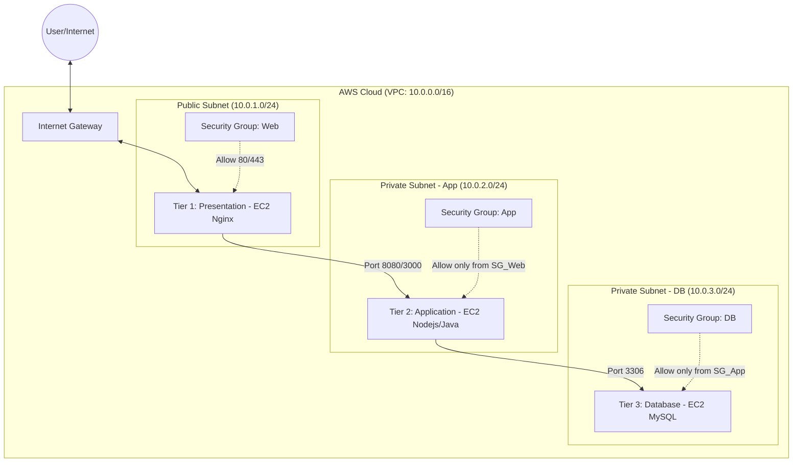
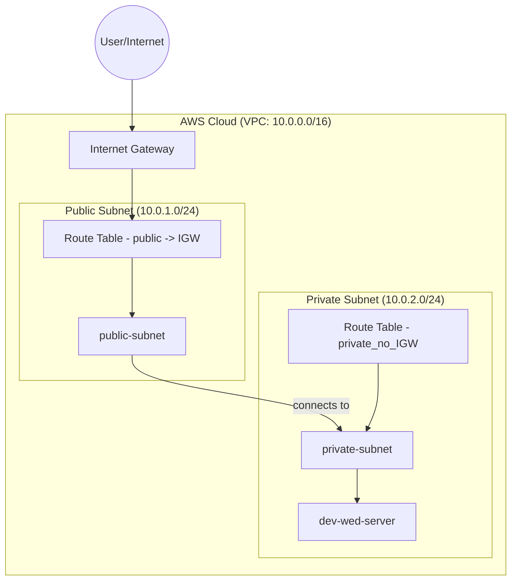

**Current implementation (application tier) — what this repo actually creates**



**Components created by this repository**

- `aws_vpc.vpc` — VPC (default CIDR `10.0.0.0/16`)
- `aws_subnet.public_subnet` — Public subnet (default `10.0.1.0/24`)
- `aws_subnet.private_subnet` — Private subnet (default `10.0.2.0/24`)
- `aws_internet_gateway.igw` — Internet Gateway attached to VPC
- `aws_route_table.associate_public_subnet` — Route table with `0.0.0.0/0` -> IGW, associated to public subnet
- `aws_route_table.associate_private_subnet` — Private route table (no internet route) associated to private subnet
- `aws_instance.free_tier` (module `compute`) — EC2 instance launched into the private subnet (no public IP)

**Module mapping**

- `modules/network` — VPC, subnets, IGW, route tables, associations
- `modules/compute` — AMI data source and EC2 instance resource

Notes

- The current repo does not create a database tier (no DB instances) — the diagram above is the actual deployed topology: single EC2 in a private subnet, a public subnet with a route to IGW, and an IGW attached to the VPC.
- If you want a 3-tier layout (Presentation / App / DB), I can extend `modules/network` and add a DB module and an additional private subnet.

If you want me to update the diagram (add security groups, NAT gateway, or a bastion host), tell me which components to include and I will modify `structure.md` accordingly.
Below is an improved, focused diagram for the _Application tier (ideal)_ and concise implementation notes. This is tuned for training/practice: it shows an internet-facing load balancer in the public subnet and multiple application instances in private subnet(s) with a NAT gateway for outbound access.

```mermaid
graph TD
    subgraph "VPC 10.0.0.0/16"
        IGW[Internet Gateway]
        NAT[NAT Gateway]

        subgraph "Public Subnet (10.0.1.0/24)"
            ALB[ALB<br/>Listener: 80/443]
            Bastion[Bastion<br/>SSH jumphost]
            RT_Public[Route Table -> IGW]
        end

        subgraph "Private Subnet - App (10.0.2.0/24)"
            ASG[Auto Scaling Group<br/>EC2 app instances]
            AppSG[App Security Group]
            RT_Private[Route Table -> NAT]
        end
    end

    %% Traffic flows
    User((Internet)) -->|80/443| ALB
    ALB -->|app port (e.g. 8080)| ASG
    Bastion -->|ssh| ASG
    ASG -->|outbound| NAT
    RT_Public --> ALB
    RT_Private --> ASG

    %% Security notes (visual)
    ALB -. "ALB SG: allow 80/443 from Internet" .-> ALB
    ASG -. "App SG: allow traffic from ALB SG (app port)" .-> ASG
    Bastion -. "Bastion SG: allow SSH from admin IPs" .-> Bastion
```

**Notes and recommendations**

- Components shown: ALB (public), Bastion (optional, for SSH administration), Auto Scaling Group / EC2 app instances (private), NAT Gateway for outbound internet access, IGW for public subnet.
- Security groups:
  - **ALB SG**: Allow inbound 80/443 from Internet (0.0.0.0/0). Allow health checks from ALB to target group.
  - **App SG**: Allow inbound only from ALB SG on app port (e.g., 8080). Allow outbound as needed (or restrict to NAT).
  - **Bastion SG**: Restrict SSH (22) to admin IP ranges only.
- Networking:
  - Public subnet's route table points to the IGW.
  - Private subnet's route table points to the NAT Gateway (in public subnet) for outbound access; no direct inbound from Internet.
- Deployment guidance:
  - Use an ALB with a target group for the app instances.
  - Use Auto Scaling for multiple app instances (min/max desired counts).
  - Register instances by private IP to the ALB target group.

If you want, I can now:

- (a) update `structure.md` to include concrete security group names/ports matching your repo,
- (b) add example Terraform snippets for ALB + ASG + NAT Gateway into `modules/network` and `modules/compute`, or
- (c) keep the diagram but simplify it further for slide-friendly rendering.
